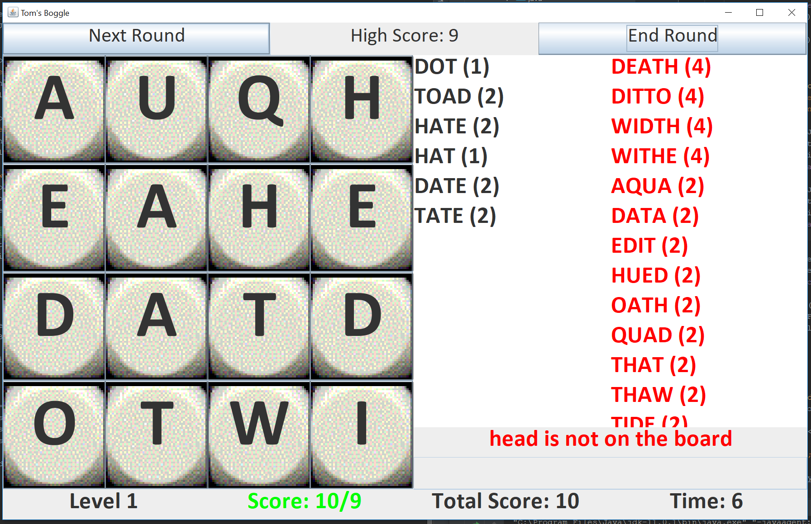

# BoggleSolitaire
My Attempt at turning the Classic word game into a single player video game.

Key features:

 - TRIE SEARCH ALGORITHM:  the game utilises a special data structure called a TRIE to efficiently find all the available
   words on the board from a dictionary of ~20,000 words

 - DIFFICULTY NORMALISATION: after some play-testing. one problem I found with Boggle as a single player game was that
   depending on how the dice fall, finding words on the board could be easy or difficult.
   I did a quick study in which i generated 1000s of boggle boards and calculated the number of available points on each board.
   If plotted on a graph, they form positively skewed bell shape curve with the mode at around 70-80 points.
   Using this knowledge i decided to make the game automatically re-roll each game board until the amount of available
   points is in this bracket. THe effect of this is to normalise the difficulty a little.

 - DIFFICULTY LEVELS:  The game is split into arcade-style levels of increasing difficulty. To achieve this the player is
   given a target score of a % of the available points on the board, and this target is gradually increased. see Board.getTargetScore

 See if you can get past level 5!
